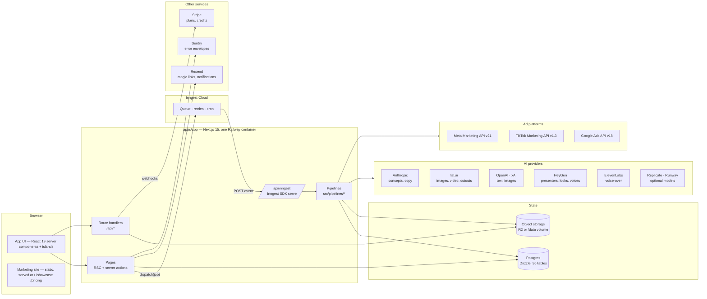
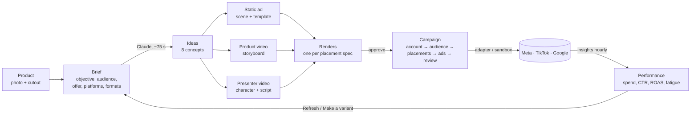
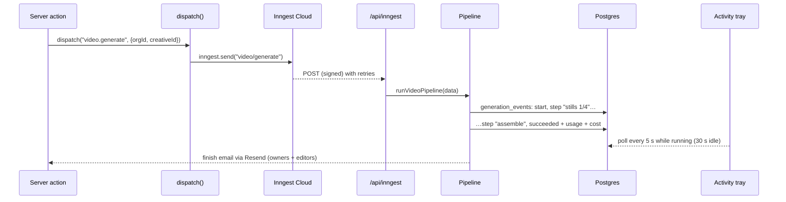
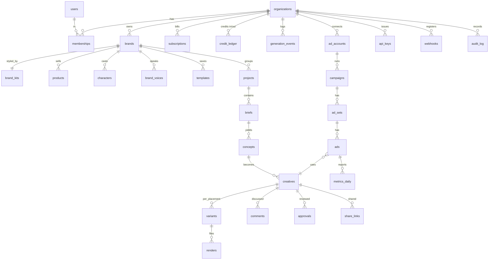

# Adcraft — architecture

_How the product is put together, why it is shaped this way, and where to look when something needs changing. Current as of 19 Sep 2026 (`main`)._

Adcraft is a SaaS for making ads (static, product video, presenter/UGC video), pushing them to Meta, TikTok and Google, reading the results back, and starting the next round from what worked. It is one Next.js application in a pnpm monorepo, backed by Postgres, with long-running generation and publishing work run as Inngest functions.

---

## 1. System overview



**One deployable.** The app, the pipelines and the video renderer (Remotion + headless Chromium) run in the same always-on container on Railway, built from the root `Dockerfile`. Postgres is a Railway service; media sits on a volume until the `R2_*` variables are set. `docs/DEPLOY.md` has the operational detail.

**Jobs go through Inngest.** Anything longer than a request — concept generation (~75 s), static ads, video, UGC, HeyGen looks and avatars, publishing, insights sync — is an Inngest function. Inngest Cloud calls the app back at `/api/inngest`, which gives retries, step durability, a dashboard and an hourly cron. When `INNGEST_EVENT_KEY` is absent (local dev without the dev server) the same pipeline function runs inline in the process, fire-and-forget.

**Every provider is behind an adapter with a sandbox.** AI models are resolved through a catalogue (`ai_models` table + built-ins) so admins can add or disable models without a deploy; ad platforms fall back to built-in sandbox providers that simulate campaigns and metrics when no platform keys exist.

---

## 2. Repository layout

```
apps/app/                 Next.js 15 application (App Router)
  src/app/(auth)/         sign-in, welcome, invites, share links
  src/app/(app)/          the workspace: dashboard, library, briefs, creatives, videos,
                          characters, campaigns, performance, brands, settings
  src/app/(admin)/        platform admin: orgs, users, billing, models, providers,
                          generations, campaigns, audit, settings
  src/app/(legal)/        terms, privacy, DPA
  src/app/api/            route handlers (auth, connect, files, uploads, inngest,
                          stripe webhook, health, share, v1 public API)
  src/server/             data access + server actions, one module per domain
  src/pipelines/          the long-running work, plain async functions
  src/inngest/            Inngest client + functions wrapping the pipelines
  src/components/         shared UI (topbar, sidebar, activity tray, pickers…)
  e2e/                    Playwright golden-path suite
packages/
  db/                     Drizzle schema, migrations, client (Postgres or PGlite)
  ai/                     provider adapters: text, image, video, voice, presenter
  ads/                    Meta / TikTok / Google adapters, sandbox, spec validation,
                          claims review
  render/                 static renderer (Satori + resvg) and Remotion video
  specs/                  placement specs (sizes, durations, copy limits)
  storage/                object storage (R2 / local disk), org-scoped keys
  ui/                     design tokens and a few primitives
dist/                     marketing site (static), copied into apps/app/public at build
docs/                     this file, DEPLOY.md, PLAN.md, UX-PLAN.md
scripts/                  start.sh (container entrypoint), backup-db.sh
```

Workspace packages are consumed as TypeScript source (`transpilePackages` in `next.config.ts`); there is no build step for `packages/*`.

---

## 3. Request paths

| Kind | Path | Notes |
|---|---|---|
| Page | `src/app/(app)/**/page.tsx` → `src/server/*-data.ts` | Server components read straight from Drizzle; `requireOrg()` resolves session → org (cookie) → brand (cookie) → role. |
| Mutation | `<form action={serverAction}>` → `src/server/*-actions.ts` | Validates, checks role and guardrails, writes, `revalidatePath`, optionally `dispatch()` a job. Redirects with `?error=` on guardrail failures. |
| Large upload | `POST /api/uploads` (XHR with progress) | Server actions are capped at 16 MB; twin footage can be 600 MB. Returns an org-scoped storage key. |
| Files | `GET /api/files/<key>` | Serves local-disk storage; with R2 the public bucket URL is used instead. |
| Background job | `dispatch(name, payload)` → Inngest event → `POST /api/inngest` → pipeline | See §5. |
| Platform OAuth | `GET /api/connect/<platform>` → provider → `/callback` | Tokens are encrypted (`TOKEN_ENCRYPTION_KEY`, else derived from `AUTH_SECRET`) into `ad_accounts`. |
| Billing | `POST /api/stripe/webhook` | Subscription + top-up events → `subscriptions`, `credit_ledger`. |
| Public API | `GET /api/v1/creatives`, `/api/v1/creatives/:id`, `/api/v1/files/*` | Bearer API keys (`api_keys`, hashed). Outbound webhooks on `creative.rendered`, `approval.*`, `comment.added`. |
| Share | `/share/<token>` + `/api/share/<token>/*` | Client review without an account: view every size, comment, approve if allowed. |
| Ops | `GET /api/health` | DB, storage, jobs with latency; 503 when DB or storage fail. |

Auth is Auth.js v5: Resend magic links, Google OAuth when configured, and a dev credentials box outside production (`DEV_LOGIN=0` hides it). `middleware.ts` protects everything except `/api/*` and static assets. Roles are `owner | editor | viewer` per membership; platform admins are `ADMIN_EMAILS`.

---

## 4. The creative loop

This is the product. Everything else exists to serve it.



**Product** (`library`): a photo is stored, then `product/cutout` removes the background (fal BiRefNet). Products can also be imported from a URL (Shopify `/products/<handle>.js` → JSON-LD → Open Graph).

**Brief** (`briefs`): the input step. `briefPrefillFromCreative` lets Performance and the Next panel open a brief pre-filled from a winner or a fatigued creative.

**Ideas** (`concepts/generate`): Claude returns eight concepts with hook, angle, platform-ready copy and a visual direction, constrained by the brand kit's tone and do/don't lists.

**Ad** — three builders share one shell (numbered cards, sticky preview, cost):
- *Static* (`static/generate` + `render/variants`): either an **editable** document (Satori + resvg, brand fonts, the product cutout composited by the template engine) or an **AI scene** (fal — Nano Banana, Seedream, FLUX, GPT Image…) behind the same template. Renders every placement size the brief asked for.
- *Product video* (`video/generate`): per-scene stills → image-to-video clips (Kling, Veo, Seedance, Runway…) → Remotion assembles sizes with captions and an end card.
- *Presenter / UGC video* (`ugc/generate`): ElevenLabs voice-over (or a HeyGen voice) → HeyGen presenter render → B-roll clips → ffmpeg assembly with captions and hook.

**Character studio** (`characters`): a cast of presenters — generated (image model), photo avatars, prompt characters and digital twins on HeyGen (`avatar/create`), looks from HeyGen look packs, templates or remixes (`character/looks`), and voices: the ElevenLabs/HeyGen catalogue plus cloned or designed workspace voices (`brand_voices`).

**Campaign** (`campaigns`): five steps. The review step runs the placement spec check (`packages/ads/validation.ts`) and the claims review (`packages/ads/claims.ts`); spend above the workspace threshold needs an owner. `publish/campaign` creates campaign → ad set → ads on the platform (paused by default) and records platform ids.

**Performance** (`performance`): `insights/cron` (hourly) and *Sync now* pull daily metrics into `metrics_daily`; the page derives spend, CTR, CPA, ROAS, per-creative rows and fatigue alerts, and offers *Refresh* (new brief) and *Pause*.

---

## 5. Background work



- **Registry.** `src/server/jobs.ts` names every job and its payload; `src/pipelines/index.ts` registers the inline handlers; `src/inngest/functions.ts` wraps the same functions as Inngest functions. Adding a job means: a payload type, a pipeline function, one `createFunction`.
- **Events.** Every provider call is a row in `generation_events` (capability, provider, model, status, step, usage, cost). The Activity tray, Admin → Generations, provider budgets and the finish emails all read from it.
- **Credits.** `reserveGenerationCredits` charges up front (`CREDIT_COSTS`: concepts 1, static ad 2, 15 s video 20, 30 s UGC 40, HeyGen look 3, avatar 5, twin 25); failures refund, partial results refund the difference.
- **Idempotence.** Video and UGC documents keep every generated asset; re-running a pipeline skips steps whose asset already exists, so a failed B-roll clip does not re-bill the voice-over.

---

## 6. Data model



Conventions: every row is scoped by `org_id` (and usually `brand_id`), ids are UUIDs, JSON columns hold provider-specific state (`creatives.document`, `characters.heygen`, `organizations.settings`). Platform-wide knobs (`platform_settings`, `ai_models`) have no org. Migrations are generated with `drizzle-kit generate` into `packages/db/drizzle` and applied on container start.

---

## 7. Cross-cutting concerns

**Guardrails** (`src/server/guardrails.ts`): monthly provider budget per workspace (platform default), optional monthly credit cap and spend-approval threshold (per workspace), token-bucket rate limits on generation starts and uploads, HeyGen voice slots per workspace, optional approval-before-publish. Enforced in server actions and pipelines; surfaced in Settings → Guardrails and Admin → Guardrail defaults.

**Brand safety**: `reviewClaims()` scans ad copy for medical, financial, guarantee, superlative, personal-attribute, false-urgency and profanity claims; hard findings block publishing, soft ones warn; brief constraints harden matching categories.

**Collaboration**: comments, approvals with `draft → in_review → changes_requested → approved`, share links for client review, team roles, audit log of settings and publishing actions.

**Billing**: Stripe subscriptions (Starter / Studio / Agency, monthly or yearly) grant credits; top-ups add; every generation debits `credit_ledger`. Trial credits come from `platform_settings`.

**Observability**: `/api/health`; `instrumentation.ts` posts unhandled server errors to Sentry's envelope endpoint when `SENTRY_DSN` is set; Admin shows provider status, generations with cost, and platform metrics.

**Testing**: `pnpm --filter @adcraft/app test` (node test runner, react-server condition) and `pnpm --filter @adcraft/app e2e` (Playwright golden path against a dev server: sign-in → dashboard → library → brief pre-fill → creative Next panel → five-step campaign builder on a sandbox account → performance sync → guardrails → health; no provider spend).

---

## 8. Where to look

| I want to… | Start at |
|---|---|
| Add a page to the workspace | `src/app/(app)/<area>/page.tsx` + `src/server/<area>-data.ts`; sidebar in `src/components/sidebar.tsx` |
| Add a background job | `src/server/jobs.ts` (payload) → `src/pipelines/<job>.ts` → `src/pipelines/index.ts` + `src/inngest/functions.ts` |
| Add an AI model or provider | `packages/ai/src/models.ts` (built-ins) or Admin → Models; adapters in `packages/ai/src/{text,image,video,voice,presenter}` |
| Add a placement size | `packages/specs/src/index.ts`; renderers pick it up from the spec |
| Add an ad platform | `packages/ads/src/<platform>/` implementing `AdsProvider` + `AdsOAuth`, register in `registry.ts`, add a sandbox in `sandbox.ts` |
| Change credit pricing | `src/server/billing.ts#CREDIT_COSTS` |
| Change a guardrail | `src/server/platform-settings.ts#DEFAULT_GUARDRAILS`, `src/server/guardrails.ts` |
| Deploy | `docs/DEPLOY.md`; `railway up --service app --detach` |
